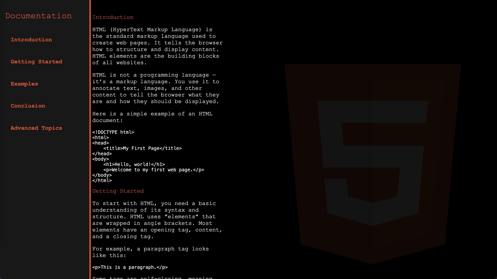

# Technical Documentation Page: HTML Reference

This project is a technical documentation page focused on HTML. It covers the basic structure, tags, and usage of HTML to help beginners and developers understand how to create and organize web pages.

The documentation includes:

- Clear explanations of key HTML elements
- Examples of syntax and usage
- Organized layout for easy navigation
- Supporting CSS for styling

## Useful Link

This project includes a link to the official [MDN Web Docs HTML Reference](https://developer.mozilla.org/en-US/docs/Web/HTML) for more detailed and comprehensive information about HTML.

## Screenshot

Below is a screenshot of the Technical Documentation Page:

---

Feel free to explore the project files to learn more about HTML and how to structure your own technical documentation pages.